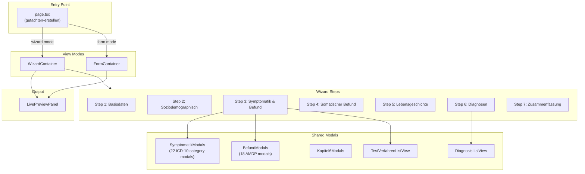
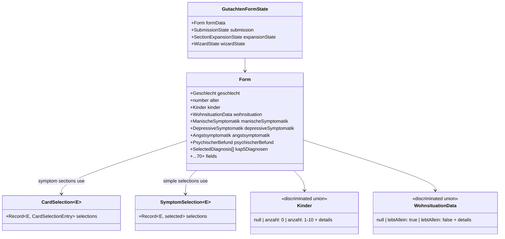
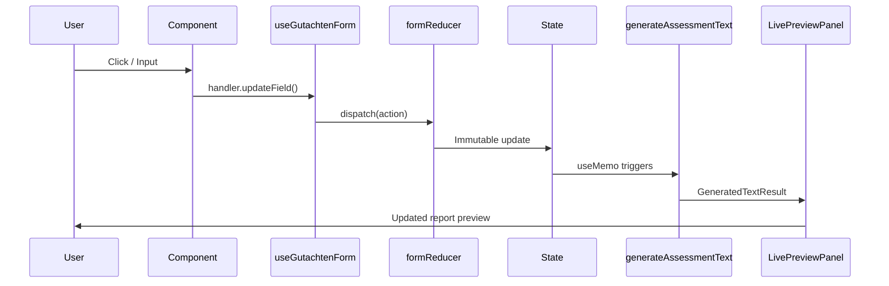

# Architecture

## Overview

Gutachtomat helps German psychotherapists create PTV3-compliant insurance assessment reports. The challenge: documenting 70+ data points (demographics, ICD-10 symptoms, AMDP clinical findings) while generating formal German text with correct grammar and gender-appropriate pronouns.

The user fills out a multi-step form and sees the generated report update in real-time.

---

## Project Structure

```
src/
├── app/
│   ├── gutachten-erstellen/           # Main application
│   │   ├── page.tsx                   # Entry point (wizard/form toggle)
│   │   └── _components/
│   │       ├── wizard/                # 7-step wizard flow
│   │       ├── form/                  # Full form view (debug)
│   │       └── shared/                # Modals (symptomatik, befund, kapitel6), preview panel
│   ├── api/                           # API routes (encryption, text improvement, webhooks)
│   ├── _components/                   # Shared app components
│   └── [faqs, tutorial, kontakt, ueber]  # Info pages
│
├── components/                        # Global shared components
├── contexts/                          # React Context (StorageContext)
│
├── hooks/
│   ├── useGutachtenForm.ts            # Central state + handlers
│   └── useAutoSave.ts                 # Auto-save functionality
│
└── lib/
    ├── core/                          # Foundation
    │   ├── form-types.ts              # Type definitions
    │   ├── form-labels.ts             # Enum → display strings
    │   ├── form-reducer.ts            # State updates
    │   └── options/                   # Symptom/field option configs
    │
    ├── text-generation/               # Report construction
    │   ├── index.ts                   # Orchestrator
    │   ├── sections/                  # Per-chapter generators (19 files)
    │   └── pronoun-utils.ts           # Gender-aware pronouns
    │
    ├── storage/                       # Data persistence
    │   ├── adapters/                  # Supabase, localStorage, dev adapters
    │   └── encryption/                # Encryption utilities
    │
    ├── supabase/                      # Supabase client & types
    ├── utils/                         # Symptom counters & utilities (40+ files)
    ├── random-generators/             # Test data generation
    └── data/                          # ICD-10, medications, test procedures
```

---

## Data Flow

```
User Input
    ↓
Component Handler
    ↓
useGutachtenForm (dispatch action)
    ↓
form-reducer (immutable update)
    ↓
Updated State
    ↓
text-generation/* (generates report)
    ↓
Live Preview Panel
```

---

## Entry Points

| To understand... | Start at |
|------------------|----------|
| Main app flow | `app/gutachten-erstellen/page.tsx` |
| State management | `hooks/useGutachtenForm.ts` |
| Text generation | `lib/text-generation/index.ts` |
| Type definitions | `lib/core/form-types.ts` |

---

## Key Decisions

### Wizard + Form modes

**Wizard** (default) shows one section at a time—reduces cognitive load when filling 70+ fields. **Form** is a debug view showing all fields at once for quickly modifying the complete data structure.

Both share the same state and components.

### Client-side text generation

Report generates entirely in the browser as the user types. No server round-trips.

Trade-off: More JavaScript shipped to client. But instant feedback is essential—users need to see exactly what their report will contain.

### Clerk for authentication

Clerk handles user authentication and account management. Chosen for GDPR compliance - no need to store sensitive user data ourselves. Clerk provides EU data residency and handles consent, data export, and deletion requests.

### Type-safe form state

**Goal:** Make invalid states impossible at compile time.

**Enums for domain values** (never include null in enum):
```typescript
enum Geschlecht { M = 'm', W = 'w', D = 'd' }
type GeschlechtField = Geschlecht | null;  // null = not selected
```

**Discriminated unions for dependent fields:**
```typescript
type Kinder =
  | null                           // not answered
  | { anzahl: 0 }                  // no children
  | { anzahl: 1; details: [...] }  // 1 child with details
```

TypeScript narrows the type automatically - when `anzahl > 0`, the `details` field exists.

All types defined in `lib/core/form-types.ts`.

### Storage architecture

Data persistence uses an adapter pattern to support multiple storage backends:

- **Supabase adapter** — Cloud storage for production (encrypted)
- **localStorage adapter** — Browser storage for offline/local use
- **Dev adapter** — Unencrypted storage for development/debugging

`StorageContext` provides the active adapter throughout the app. The encryption layer in `lib/storage/encryption/` handles client-side encryption before data reaches Supabase.

### API routes

| Route | Purpose |
|-------|---------|
| `/api/encryption-key` | Manages encryption keys for secure storage |
| `/api/improve-text` | AI-powered text improvement (Anthropic SDK) |
| `/api/user-permissions` | Checks user permission levels |
| `/api/webhooks/clerk` | Handles Clerk authentication webhooks |

---

## Visual Diagrams

### Component Hierarchy



### Data Model



### Data Flow



### Wizard Navigation

```mermaid
stateDiagram-v2
    [*] --> Step1: Start

    Step1: Basisdaten
    Step2: Soziodemographisch
    Step3: Symptomatik & Befund
    Step4: Somatischer Befund
    Step5: Lebensgeschichte
    Step6: Diagnosen
    Step7: Zusammenfassung

    Step1 --> Step2: Next
    Step2 --> Step3: Next
    Step3 --> Step4: Next
    Step4 --> Step5: Next
    Step5 --> Step6: Next
    Step6 --> Step7: Next
    Step7 --> [*]: Complete

    Step2 --> Step1: Back
    Step3 --> Step2: Back
    Step4 --> Step3: Back
    Step5 --> Step4: Back
    Step6 --> Step5: Back
    Step7 --> Step6: Back

    state Step3 {
        [*] --> S3_1
        S3_1: Symptomatik
        S3_2: Verlauf & Auslöser
        S3_3: Verhaltensauffälligkeiten
        S3_4: AMDP Befund
        S3_5: Testdiagnostik
        S3_1 --> S3_2
        S3_2 --> S3_3
        S3_3 --> S3_4
        S3_4 --> S3_5
    }

    state Step4 {
        [*] --> S4_1
        S4_1: Vorerkrankungen
        S4_2: Medikation
        S4_3: Vorbehandlungen
        S4_4: Familienanamnese
        S4_5: Suchtanamnese
        S4_1 --> S4_2
        S4_2 --> S4_3
        S4_3 --> S4_4
        S4_4 --> S4_5
    }

    state Step5 {
        [*] --> S5_1
        S5_1: Lebensgeschichte
        S5_2: Krankheitsanamnese
        S5_3: Bedingungsmodell
        S5_1 --> S5_2
        S5_2 --> S5_3
    }
```



---

## Related Docs

- [docs/CONTRIBUTING.md](docs/CONTRIBUTING.md) — How to add new fields/sections
- [docs/patterns/card-selection-pattern.md](docs/patterns/card-selection-pattern.md) — CardSelection UI pattern
- [docs/style-guide.md](docs/style-guide.md) — German text generation rules
