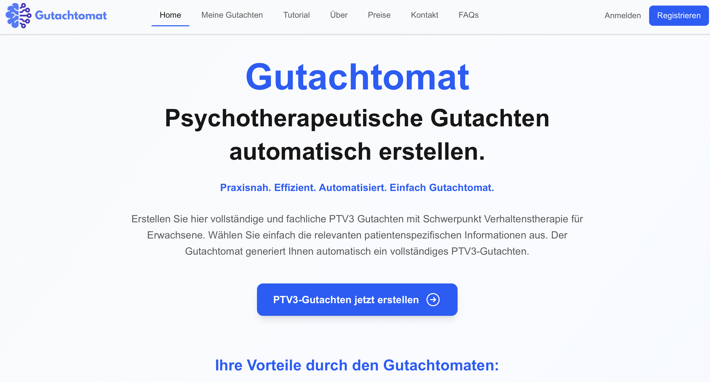
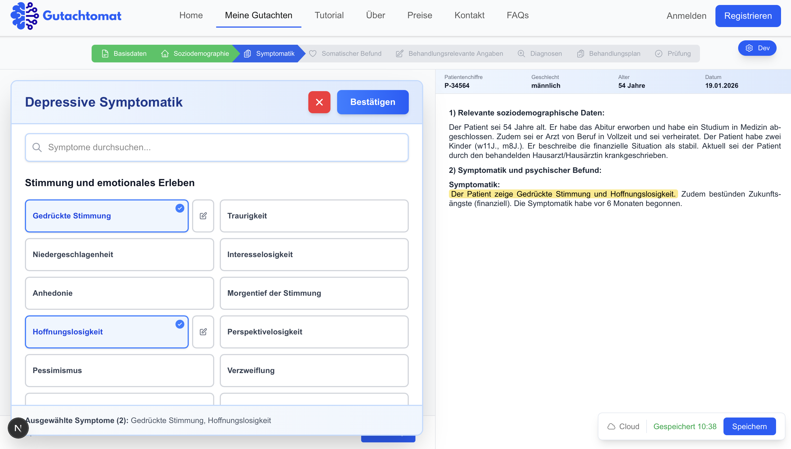
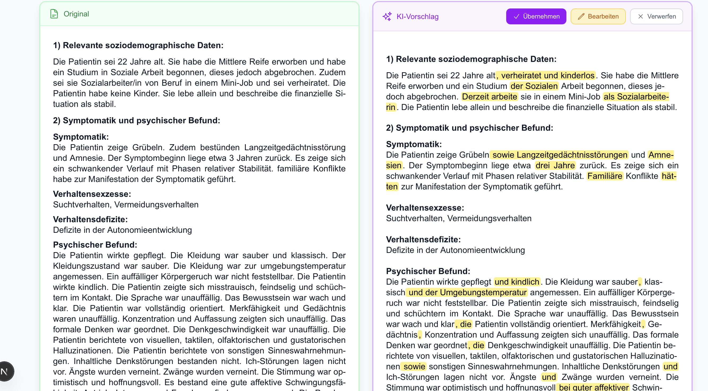
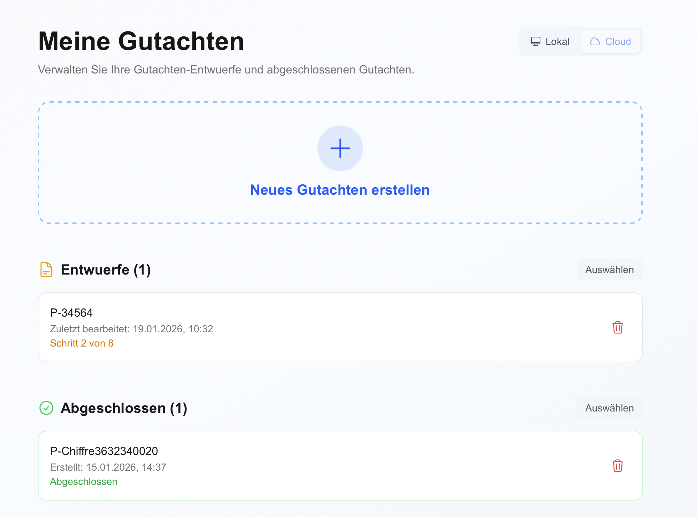
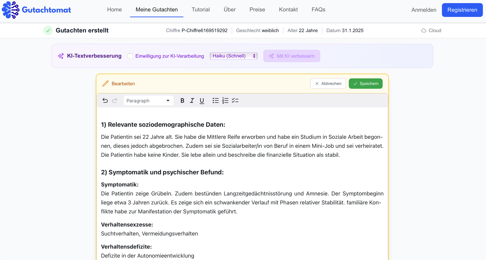
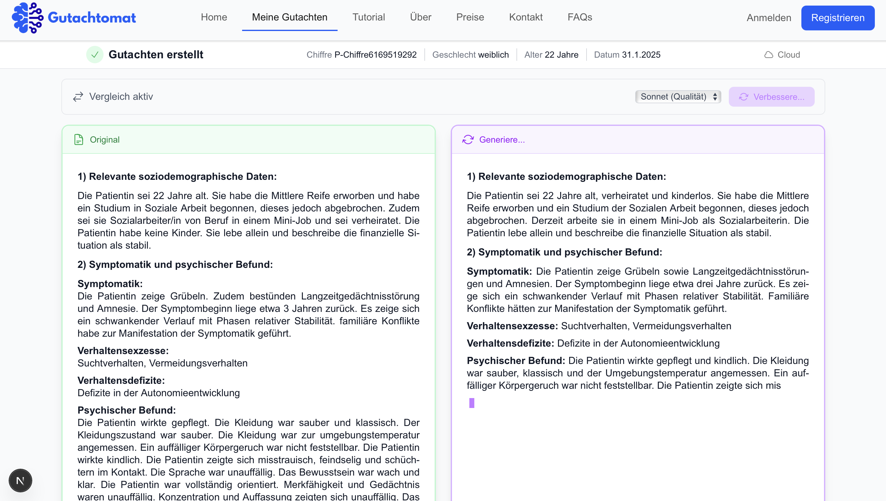

# Gutachtomat

A web application for generating form-based compliant psychological assessment reports for clinical documentation.

| | | |
|:--:|:--:|:--:|
|  |  |  |

## What It Does

- **Form-Based Reports** — Generates structured reports following the German Psychotherapist Procedure standard
- **Live Text Preview** — Real-time report generation as you fill out the form
- **ICD-10 Diagnoses** — Full diagnosis catalog with categorized symptom selection
- **AMDP Assessment** — Complete psychopathological findings structure
- **Professional German** — Automated formal medical language with correct grammar

## Tech Stack

- Next.js 15 (App Router) / React 19 / TypeScript
- Tailwind CSS v4 / Turbopack
- Clerk (GDPR-compliant authentication)
- Supabase (optional cloud storage)
- Anthropic SDK (AI text improvement)
- Jest + React Testing Library

## Project Structure

```
src/
├── app/                          # Next.js pages & wizard UI
│   ├── gutachten-erstellen/      # Main form wizard
│   │   └── _components/          # Wizard, form, and shared components
│   ├── api/                      # API routes (encryption, text improvement)
│   └── [info pages]              # tutorial, faqs, kontakt, ueber, etc.
├── components/                   # Global shared components
├── contexts/                     # React Context (StorageContext)
├── hooks/
│   ├── useGutachtenForm.ts       # Form state management
│   └── useAutoSave.ts            # Auto-save functionality
└── lib/
    ├── core/                     # Types, reducer, config
    │   ├── form-types.ts         # TypeScript definitions
    │   ├── form-labels.ts        # Enum → display strings
    │   ├── form-reducer.ts       # Generic field path reducer
    │   └── options/              # Symptom/Befund configs
    ├── data/                     # ICD-10, medications, test procedures
    ├── storage/                  # Storage adapters & encryption
    │   ├── adapters/             # Supabase, localStorage, dev adapters
    │   └── encryption/           # Encryption utilities
    ├── supabase/                 # Supabase client & types
    ├── text-generation/          # Report text construction
    │   ├── sections/             # Per-chapter generators (19 files)
    │   └── pronoun-utils.ts      # Gender-aware pronouns
    ├── utils/                    # Symptom counters & utilities (40+ files)
    └── random-generators/        # Test data generation
```

See [ARCHITECTURE.md](ARCHITECTURE.md) for technical details.

<details>
<summary><strong>Gallery</strong></summary>

| | | |
|:--:|:--:|:--:|
|  |  |  |
|  |  |  |
|  | | |

</details>

## Disclaimer

This software is provided "as is" without warranty of any kind, express or implied. The author assumes no liability for any damages or consequences arising from the use of this software.

This is not a certified medical device. Any clinical documentation generated must be reviewed and verified by a qualified professional before use. Use at your own risk.

## License

© 2025 Lukas Bold. All rights reserved.
